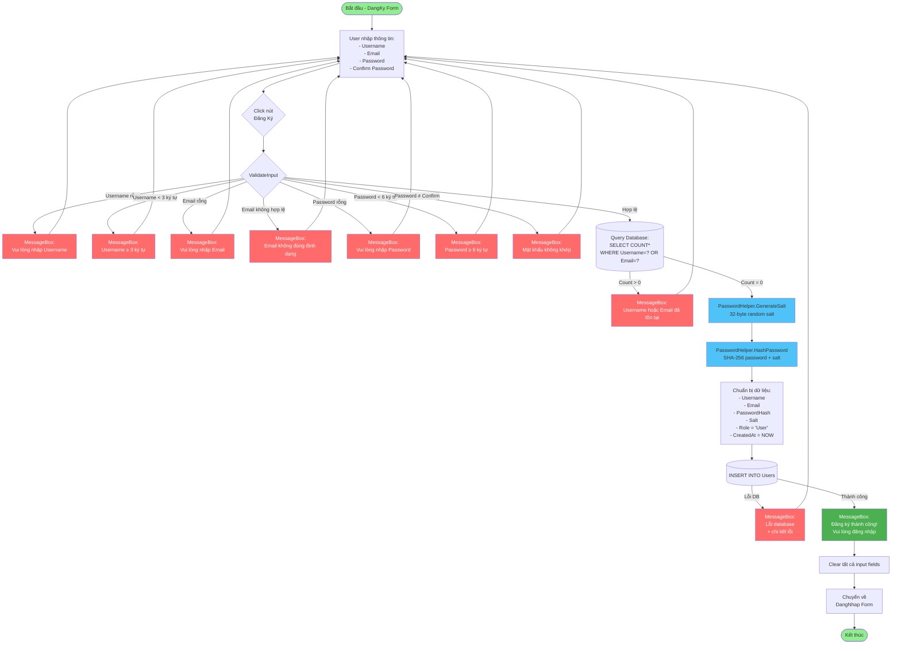

# TÀI LIỆU PHÂN TÍCH HỆ THỐNG
## Hệ Thống Quản Lý Công Việc - Windows Forms Application

---

## 1. TỔNG QUAN HỆ THỐNG

### 1.1. Thông Tin Dự Án
- **Tên dự án**: path_2 (Hệ thống quản lý công việc)
- **Công nghệ**: Windows Forms Application (.NET Framework 4.7.2)
- **Ngôn ngữ**: C#
- **Database**: MySQL 
- **Kết nối Database**: ODBC Driver
- **IDE**: Visual Studio 2022

### 1.2. Mục Đích
Xây dựng ứng dụng desktop quản lý công việc với phân quyền Admin/User, cho phép:
- Quản lý nhân viên (Admin)
- Giao việc cho nhân viên (Admin)
- Theo dõi công việc được giao (User)
- Xác thực và phân quyền người dùng

### 1.3. Đặc Điểm Chính
- **Bảo mật**: Mã hóa mật khẩu bằng SHA-256 với Salt
- **Phân quyền**: Role-based Access Control (Admin/User)
- **Kiến trúc**: 3-layer Architecture (Presentation, Business Logic, Data Access)
- **Database**: Sử dụng ODBC DSN để kết nối MySQL

---

## 2. KIẾN TRÚC HỆ THỐNG

### 2.1. Công Nghệ Sử Dụng

#### Backend
- **.NET Framework**: 4.7.2
- **Platform**: x64 (Windows Desktop)
- **UI Framework**: Windows Forms

#### Database
- **RDBMS**: MySQL 
- **Driver**: ODBC (MySQL_PATH1 DSN)
- **Database Name**: `path_1`

#### Thư Viện Chính
- `MySql.Data` v9.6.0 - MySQL ADO.NET Connector
- `System.Data.Odbc` - ODBC Data Provider
- `BouncyCastle.Cryptography` v2.6.2 - Cryptography operations
- `Google.Protobuf` v3.32.0 - Protocol Buffers

### 2.2. Mô Hình Kiến Trúc

```
┌─────────────────────────────────────────────────────────┐
│              PRESENTATION LAYER                         │
│  ┌──────────┐ ┌──────────┐ ┌──────────┐ ┌──────────┐  │
│  │ DangNhap │ │ DangKy   │ │Dashboard │ │QuanLyCong│  │
│  │  Form    │ │  Form    │ │  Form    │ │ViecForm  │  │
│  └──────────┘ └──────────┘ └──────────┘ └──────────┘  │
│  ┌──────────┐                                           │
│  │UserMgmt  │                                           │
│  │  Form    │                                           │
│  └──────────┘                                           │
└─────────────────────────────────────────────────────────┘
                        ▼
┌─────────────────────────────────────────────────────────┐
│            BUSINESS LOGIC LAYER                         │
│  ┌──────────────┐  ┌──────────────┐  ┌──────────────┐  │
│  │PasswordHelper│  │  CurrentUser │  │  Constants   │  │
│  └──────────────┘  └──────────────┘  └──────────────┘  │
└─────────────────────────────────────────────────────────┘
                        ▼
┌─────────────────────────────────────────────────────────┐
│              DATA ACCESS LAYER                          │
│  ┌──────────────────────────────────────────────────┐   │
│  │          DatabaseHelper (ODBC)                   │   │
│  │  - ConnectDB()                                   │   │
│  │  - ExecuteReader()                               │   │
│  │  - ExecuteNonQuery()                             │   │
│  └──────────────────────────────────────────────────┘   │
└─────────────────────────────────────────────────────────┘
                        ▼
┌─────────────────────────────────────────────────────────┐
│                  MySQL Database                         │
│              (via ODBC DSN: MySQL_PATH1)                │
│  ┌──────────┐              ┌──────────┐                 │
│  │  Users   │◄────────────┐│   Jobs   │                 │
│  └──────────┘             │└──────────┘                 │
│                           │                             │
│                       FK  │  FK                         │
│                   (CreatedBy, AssignedTo)               │
└─────────────────────────────────────────────────────────┘
```

### 2.3. Design Patterns

#### 1. Singleton Pattern
- **Class**: `DatabaseHelper`
- **Mục đích**: Quản lý kết nối database tập trung

#### 2. Static Helper Pattern
- **Classes**: `PasswordHelper`, `Constants`, `CurrentUser`
- **Mục đích**: Cung cấp các utility functions và shared state

#### 3. Form-based Navigation
- **Mục đích**: Quản lý navigation giữa các forms
- **Implementation**: Show/Hide forms khi chuyển trang

---

## 3. PHÂN TÍCH DATABASE

### 3.1. Database Schema

#### Bảng `Users`
```sql
CREATE TABLE Users (
    Id INT PRIMARY KEY AUTO_INCREMENT,
    Username VARCHAR(100) UNIQUE NOT NULL,
    Email VARCHAR(150) UNIQUE NOT NULL,
    PasswordHash VARCHAR(255) NOT NULL,
    Salt VARCHAR(255) NOT NULL,
    Role VARCHAR(50) DEFAULT 'User',
    CreatedAt DATETIME DEFAULT CURRENT_TIMESTAMP,
    LastLogin DATETIME NULL,
    
    INDEX IDX_Username (Username),
    INDEX IDX_Email (Email),
    INDEX IDX_Role (Role)
);
```

**Mục đích**: Lưu trữ thông tin người dùng và xác thực

**Columns chính**:
- `PasswordHash`: Mật khẩu đã hash bằng SHA-256
- `Salt`: Salt ngẫu nhiên để tăng bảo mật
- `Role`: Phân quyền (Admin/User)

#### Bảng `Jobs`
```sql
CREATE TABLE Jobs (
    Id INT PRIMARY KEY AUTO_INCREMENT,
    UserId INT NOT NULL,
    CreatedBy INT NOT NULL,
    AssignedTo INT NULL,
    Name VARCHAR(200) NOT NULL,
    Difficulty VARCHAR(20) NOT NULL,
    CreatedAt DATETIME DEFAULT CURRENT_TIMESTAMP,
    
    FOREIGN KEY (UserId) REFERENCES Users(Id) ON DELETE CASCADE,
    FOREIGN KEY (CreatedBy) REFERENCES Users(Id) ON DELETE CASCADE,
    FOREIGN KEY (AssignedTo) REFERENCES Users(Id) ON DELETE SET NULL,
    
    INDEX IDX_Jobs_UserId (UserId),
    INDEX IDX_Jobs_CreatedBy (CreatedBy),
    INDEX IDX_Jobs_AssignedTo (AssignedTo)
);
```

**Mục đích**: Quản lý công việc và phân công

**Foreign Keys**:
- `CreatedBy`: Người tạo công việc (Admin)
- `AssignedTo`: Người được giao việc (User)

### 3.2. Entity Relationship Diagram

```
┌─────────────────────┐
│       Users         │
│─────────────────────│
│ • Id (PK)          │
│   Username         │
│   Email            │◄─────┐
│   PasswordHash     │      │
│   Salt             │      │ FK: CreatedBy
│   Role             │      │
│   CreatedAt        │      │
│   LastLogin        │      │
└─────────────────────┘      │
         ▲                   │
         │                   │
         │ FK: AssignedTo    │
         │                   │
         │            ┌──────┴──────────┐
         │            │      Jobs       │
         │            │─────────────────│
         └────────────│ • Id (PK)      │
                      │   UserId       │
                      │   CreatedBy (FK) │
                      │   AssignedTo (FK)│
                      │   Name         │
                      │   Difficulty   │
                      │   CreatedAt    │
                      └─────────────────┘
```

**Quan hệ**:
- 1 User có thể tạo nhiều Jobs (1:N - CreatedBy)
- 1 User có thể được giao nhiều Jobs (1:N - AssignedTo)
- Jobs CASCADE DELETE khi User bị xóa

### 3.3. ODBC Connection String
```
DSN=MySQL_PATH1;DATABASE=path_1;
```

---

## 4. PHÂN TÍCH CÁC MODULE CHÍNH

### 4.1. Authentication Module

#### `DangNhap.cs` - Login Form
**Chức năng**:
- Xác thực user qua username/password
- Verify password bằng PasswordHelper
- Lưu thông tin user vào `CurrentUser`
- Chuyển hướng đến MainDashboard sau khi login thành công

**Flow**:
```
User nhập credentials
    ↓
ValidateInput()
    ↓
LoginUser()
    ↓
Query database: SELECT Id, Username, Email, PasswordHash, Salt, Role
    ↓
PasswordHelper.VerifyPassword(password, storedHash, storedSalt)
    ↓
[Thành công] → Lưu CurrentUser → UpdateLastLogin → Mở MainDashboard
[Thất bại] → Hiển thị lỗi
```

**Security Features**:
- Password không lưu plain text
- Sử dụng parameterized queries (chống SQL Injection)
- Hiển thị thông báo lỗi generic (không tiết lộ thông tin)

#### `DangKy.cs` - Registration Form
**Chức năng**:
- Đăng ký tài khoản mới
- Validate input (username ≥3 chars, password ≥6 chars, email format)
- Kiểm tra duplicate username/email
- Hash password với salt ngẫu nhiên

**Flow**:



#### `PasswordHelper.cs` - Password Security
```csharp
public static class PasswordHelper
{
    // Tạo salt ngẫu nhiên 32 bytes
    public static string GenerateSalt()
    {
        byte[] saltBytes = new byte[32];
        using (var rng = new RNGCryptoServiceProvider())
        {
            rng.GetBytes(saltBytes);
        }
        return Convert.ToBase64String(saltBytes);
    }

    // Hash password với SHA-256
    public static string HashPassword(string password, string salt)
    {
        using (var sha256 = SHA256.Create())
        {
            string combined = password + salt;
            byte[] bytes = sha256.ComputeHash(Encoding.UTF8.GetBytes(combined));
            return Convert.ToBase64String(bytes);
        }
    }

    // Verify password
    public static bool VerifyPassword(string password, string hash, string salt)
    {
        string computedHash = HashPassword(password, salt);
        return computedHash == hash;
    }
}
```

### 4.2. Authorization Module

#### `CurrentUser.cs` - Session Management
```csharp
public static class CurrentUser
{
    public static int Id { get; set; }
    public static string Username { get; set; }
    public static string Email { get; set; }
    public static string Role { get; set; }

    public static bool IsAdmin => Role == "Admin";
    public static bool IsUser => Role == "User";

    public static void Clear()
    {
        Id = 0;
        Username = null;
        Email = null;
        Role = null;
    }
}
```

**Mục đích**: 
- Lưu trữ thông tin user đang login (in-memory session)
- Kiểm tra quyền truy cập

**Sử dụng**:
```csharp
// Kiểm tra quyền Admin
if (CurrentUser.IsAdmin) { ... }

// Lấy UserId để query
int userId = CurrentUser.Id;
```

### 4.3. Main Dashboard Module

#### `MainDashboardForm.cs`
**Chức năng**:
- Trang chủ sau khi login
- Điều hướng đến các module con
- Hiển thị menu khác nhau theo Role

**Role-based UI**:
```csharp
private void ConfigureForRole()
{
    if (CurrentUser.IsAdmin)
    {
        // Admin menu
        btnUserManagement.Visible = true;
        btnJobManagement.Text = "Quản Lý Công Việc (Giao việc)";
    }
    else
    {
        // User menu
        btnUserManagement.Visible = false;
        btnJobManagement.Text = "Công Việc Của Tôi";
    }
}
```

**Navigation Menu**:
- **Admin**:
  - 👥 Quản Lý Nhân Viên → `UserManagementForm`
  - 📋 Quản Lý Công Việc → `QuanLyCongViec`
  - 🚪 Đăng Xuất
- **User**:
  - 📋 Công Việc Của Tôi → `QuanLyCongViec`
  - 🚪 Đăng Xuất

### 4.4. User Management Module

#### `UserManagementForm.cs` - Quản Lý Nhân Viên (Admin Only)
**Chức năng**:
- Thêm nhân viên mới
- Sửa thông tin nhân viên
- Xóa nhân viên
- Xem danh sách tất cả nhân viên

**CRUD Operations**:

##### CREATE - Thêm nhân viên
```csharp
INSERT INTO Users (Username, Email, PasswordHash, Salt, Role, CreatedAt)
VALUES (?, ?, ?, ?, ?, ?)
```

##### READ - Lấy danh sách
```csharp
SELECT Id, Username, Email, Role, CreatedAt 
FROM Users 
ORDER BY CreatedAt DESC
```

##### UPDATE - Cập nhật thông tin
```csharp
UPDATE Users 
SET Username = ?, Email = ?, Role = ? 
WHERE Id = ?
```

##### DELETE - Xóa nhân viên
```csharp
DELETE FROM Users WHERE Id = ?
-- CASCADE: Jobs của user này cũng bị xóa
```

**Access Control**:
```csharp
public UserManagementForm()
{
    if (!CurrentUser.IsAdmin)
    {
        MessageBox.Show("Bạn không có quyền truy cập!");
        this.Close();
        return;
    }
    LoadUsers();
}
```

**Business Rules**:
- ❌ Không cho xóa tài khoản Admin chính (Id = 1)
- ❌ Không cho xóa chính mình
- ✅ Chỉ Admin mới truy cập được form này

### 4.5. Job Management Module

#### `QuanLyCongViec.cs` - Quản Lý Công Việc
**Chức năng khác nhau theo Role**:

##### Admin View
- ✅ Giao việc cho nhân viên
- ✅ Sửa/Xóa công việc đã tạo
- ✅ Xem TẤT CẢ công việc trong hệ thống

##### User View
- ✅ Xem công việc được giao cho MÌNH
- ❌ Không thể thêm/sửa/xóa

**CRUD Operations (Admin)**:

##### CREATE - Giao việc
```csharp
INSERT INTO Jobs (UserId, CreatedBy, AssignedTo, Name, Difficulty, CreatedAt) 
VALUES (?, ?, ?, ?, ?, ?)

// UserId = CurrentUser.Id (người tạo)
// CreatedBy = CurrentUser.Id
// AssignedTo = selectedUser.Id (người được giao)
```

##### READ - Lấy danh sách jobs

**Admin query**:
```csharp
SELECT j.Id, j.Name, j.Difficulty, j.CreatedAt,
       creator.Username AS 'Người tạo',
       IFNULL(assignee.Username, '(Chưa giao)') AS 'Người nhận'
FROM Jobs j
LEFT JOIN Users creator ON j.CreatedBy = creator.Id
LEFT JOIN Users assignee ON j.AssignedTo = assignee.Id
ORDER BY j.CreatedAt DESC
```

**User query**:
```csharp
SELECT j.Id, j.Name, j.Difficulty, j.CreatedAt,
       creator.Username AS 'Người giao'
FROM Jobs j
LEFT JOIN Users creator ON j.CreatedBy = creator.Id
WHERE j.AssignedTo = ?  -- CurrentUser.Id
ORDER BY j.CreatedAt DESC
```

##### UPDATE - Sửa công việc
```csharp
UPDATE Jobs 
SET Name = ?, Difficulty = ?, AssignedTo = ? 
WHERE Id = ? AND CreatedBy = ?
-- Chỉ sửa được job do mình tạo
```

##### DELETE - Xóa công việc
```csharp
DELETE FROM Jobs 
WHERE Id = ? AND CreatedBy = ?
-- Chỉ xóa được job do mình tạo
```

**UI Configuration theo Role**:
```csharp
private void ConfigureForRole()
{
    if (CurrentUser.IsAdmin)
    {
        // Hiển thị ComboBox giao việc
        lblAssignTo.Visible = true;
        cmbAssignTo.Visible = true;
        
        btnAdd.Enabled = true;
        btnEdit.Enabled = true;
        btnDelete.Enabled = true;
    }
    else
    {
        // Ẩn ComboBox, disable buttons
        lblAssignTo.Visible = false;
        cmbAssignTo.Visible = false;
        
        btnAdd.Enabled = false;
        btnEdit.Enabled = false;
        btnDelete.Enabled = false;
    }
}
```

### 4.6. Database Helper Module

#### `DatabaseHelper.cs` - Data Access Layer
**Chức năng**:
- Quản lý kết nối ODBC
- Execute queries
- Xử lý exceptions

**Main Methods**:

##### ConnectDB()
```csharp
public static void ConnectDB()
{
    connection = new OdbcConnection(connectionString);
    if (connection.State == ConnectionState.Closed)
    {
        connection.Open();
    }
}
```

##### GetConnection()
```csharp
public static OdbcConnection GetConnection()
{
    return new OdbcConnection(connectionString);
}
```

##### ExecuteNonQuery() - INSERT/UPDATE/DELETE
```csharp
public static int ExecuteNonQuery(string sqlCommand)
{
    using (OdbcConnection conn = GetConnection())
    {
        conn.Open();
        using (OdbcCommand cmd = new OdbcCommand(sqlCommand, conn))
        {
            return cmd.ExecuteNonQuery();
        }
    }
}
```

##### ExecuteReader() - SELECT
```csharp
public static OdbcDataReader ExecuteReader(string sqlCommand)
{
    if (connection == null || connection.State == ConnectionState.Closed)
    {
        ConnectDB();
    }
    
    dml = new OdbcCommand(sqlCommand, connection);
    dr = dml.ExecuteReader();
    return dr;
}
```

**Error Handling**:
```csharp
catch (OdbcException odbcEx)
{
    string errorMessage = "";
    foreach (OdbcError error in odbcEx.Errors)
    {
        errorMessage += $"Message: {error.Message}\n";
        errorMessage += $"SQL State: {error.SQLState}\n";
    }
    MessageBox.Show(errorMessage);
    throw;
}
```

### 4.7. Constants Module

#### `Constants.cs` - Centralized Messages & Error Codes
```csharp
public static class Constants
{
    // Error codes
    public const string ERR_DB_CONNECTION = "DB001";
    public const string ERR_DB_QUERY = "DB002";
    public const string ERR_LOGIN_FAILED = "AUTH001";

    // Database messages
    public static class DbMessages
    {
        public const string CONNECTION_FAILED = "Không thể kết nối database";
        public const string QUERY_ERROR = "Lỗi truy vấn database";
    }

    // Auth messages
    public static class AuthMessages
    {
        public const string LOGIN_SUCCESS = "Đăng nhập thành công";
        public const string LOGIN_FAILED = "Tên đăng nhập hoặc mật khẩu không đúng";
    }

    // Validation messages
    public static class ValidationMessages
    {
        public static string RequiredField(string fieldName) 
            => $"Vui lòng nhập {fieldName}";
    }
}
```

---

## 5. USE CASES VÀ WORKFLOWS

### 5.1. Use Case Diagram

```
                    ┌─────────────┐
                    │   System    │
    ┌───────────────┤   Actor     ├───────────────┐
    │               └─────────────┘               │
    │                                             │
    ▼                                             ▼
┌────────┐                                   ┌────────┐
│ Admin  │                                   │  User  │
└────┬───┘                                   └───┬────┘
     │                                           │
     ├─ Đăng nhập                                ├─ Đăng nhập
     ├─ Đăng ký                                  ├─ Đăng ký
     ├─ Quản lý nhân viên                        ├─ Xem công việc
     │   ├─ Thêm nhân viên                       └─ Đăng xuất
     │   ├─ Sửa nhân viên
     │   └─ Xóa nhân viên
     ├─ Quản lý công việc
     │   ├─ Giao việc
     │   ├─ Sửa công việc
     │   ├─ Xóa công việc
     │   └─ Xem tất cả công việc
     └─ Đăng xuất
```

### 5.2. Workflow: Login Process

```
START
  ↓
[DangNhap Form]
  ↓
User nhập username, password
  ↓
Click "Đăng nhập"
  ↓
ValidateInput()
  ├─ [Empty?] → Show error → END
  └─ [OK] → Continue
      ↓
Execute query: SELECT user info
  ├─ [Not found] → Show "Sai thông tin" → END
  └─ [Found] → Continue
      ↓
PasswordHelper.VerifyPassword()
  ├─ [Fail] → Show "Sai mật khẩu" → END
  └─ [Success] → Continue
      ↓
Update LastLogin = NOW()
      ↓
Set CurrentUser (Id, Username, Email, Role)
      ↓
Open MainDashboardForm
      ↓
Hide DangNhap Form
      ↓
END
```

### 5.3. Workflow: Admin Giao Việc

```
START (MainDashboard)
  ↓
Click "Quản Lý Công Việc"
  ↓
[QuanLyCongViec Form]
  ↓
ConfigureForRole() → Admin mode
  ├─ Show combobox "Chọn nhân viên"
  ├─ Enable Add/Edit/Delete buttons
  └─ Load danh sách users vào combobox
  ↓
LoadJobs()
  ├─ Query: SELECT ALL Jobs với JOIN Users
  └─ Display in DataGridView
      ├─ Id
      ├─ Tên công việc
      ├─ Độ khó
      ├─ Ngày tạo
      ├─ Người tạo
      └─ Người nhận
  ↓
Admin nhập thông tin công việc
  ├─ Tên công việc (TextBox)
  ├─ Độ khó: Easy/Medium/Hard (ComboBox)
  └─ Chọn nhân viên nhận việc (ComboBox)
  ↓
Click "Thêm"
  ↓
ValidateInput()
  ├─ [Tên rỗng?] → Show "Vui lòng nhập tên công việc!" → BACK
  ├─ [Độ khó rỗng?] → Show "Vui lòng chọn độ khó!" → BACK
  ├─ [Chưa chọn nhân viên?] → Show "Vui lòng chọn nhân viên!" → BACK
  └─ [OK] → Continue
      ↓
Chuẩn bị dữ liệu
  ├─ UserId = CurrentUser.Id
  ├─ CreatedBy = CurrentUser.Id (Admin)
  ├─ AssignedTo = SelectedUser.Id (Nhân viên)
  ├─ Name = txtJobName.Text
  ├─ Difficulty = cmbDifficulty.SelectedItem
  └─ CreatedAt = DateTime.Now
      ↓
INSERT INTO Jobs (UserId, CreatedBy, AssignedTo, Name, Difficulty, CreatedAt)
VALUES (?, ?, ?, ?, ?, ?)
  ├─ [Lỗi DB?] → Show lỗi chi tiết → BACK
  └─ [Thành công] → Continue
      ↓
LoadJobs() - Refresh DataGridView
      ↓
Clear inputs (reset form)
      ↓
Show "Giao việc thành công!"
      ↓
[Tiếp tục giao việc?]
  ├─ [Có] → BACK to "Admin nhập thông tin"
  └─ [Không] → Click "Về Dashboard"
      ↓
END
```


### 5.4. Workflow: User Xem Công Việc

```
START (MainDashboard)
  ↓
Click "Công Việc Của Tôi"
  ↓
[QuanLyCongViec Form]
  ↓
ConfigureForRole() → User mode
  ├─ Hide combobox "Chọn nhân viên"
  └─ Disable Add/Edit/Delete buttons
  ↓
LoadJobs()
  ├─ Query: WHERE AssignedTo = CurrentUser.Id
  └─ Display in DataGridView
      ├─ Tên công việc
      ├─ Độ khó
      ├─ Ngày tạo
      └─ Người giao
  ↓
User chỉ xem, không thao tác được
  ↓
Click "Về Dashboard"
  ↓
END
```

### 5.5. Sequence Diagram: Login Flow

```
DangNhap         DatabaseHelper         MySQL          CurrentUser      MainDashboard
  │                    │                  │                  │                │
  │ btnLogin_Click     │                  │                  │                │
  ├────────────────────┼──────────────────┼──────────────────┼────────────────┤
  │                    │                  │                  │                │
  │ ValidateInput() ───┤                  │                  │                │
  │   [OK]             │                  │                  │                │
  │                    │                  │                  │                │
  │ GetConnection() ───►                  │                  │                │
  │◄───────────────────┤                  │                  │                │
  │                    │                  │                  │                │
  │ ExecuteReader() ───┼─────────────────►│                  │                │
  │   "SELECT * FROM Users WHERE..."      │                  │                │
  │◄───────────────────┼──────────────────┤                  │                │
  │   [User data]      │                  │                  │                │
  │                    │                  │                  │                │
  │ VerifyPassword()   │                  │                  │                │
  │   [Success]        │                  │                  │                │
  │                    │                  │                  │                │
  │ UpdateLastLogin() ─┼─────────────────►│                  │                │
  │   "UPDATE Users SET LastLogin=NOW()"  │                  │                │
  │                    │                  │                  │                │
  │ Set CurrentUser ───┼──────────────────┼─────────────────►│                │
  │   (Id, Username, Email, Role)         │                  │                │
  │                    │                  │                  │                │
  │ new MainDashboard()┼──────────────────┼──────────────────┼───────────────►│
  │ Show()             │                  │                  │                │
  │ this.Hide()        │                  │                  │                │
  │                    │                  │                  │                │
```

---

## 6. BẢO MẬT VÀ AUTHORIZATION

### 6.1. Password Security

#### Hashing Algorithm
- **Algorithm**: SHA-256
- **Salt**: Random 32-byte salt per user
- **Storage**: Lưu cả Hash và Salt trong database

#### Implementation
```csharp
// Đăng ký
string salt = GenerateSalt();  // Random 32 bytes
string hash = HashPassword(password, salt);  // SHA-256(password + salt)
INSERT INTO Users (..., PasswordHash, Salt) VALUES (..., hash, salt)

// Đăng nhập
SELECT PasswordHash, Salt FROM Users WHERE Username = ?
string computedHash = HashPassword(inputPassword, storedSalt);
if (computedHash == storedHash) { LOGIN SUCCESS }
```

**Ưu điểm**:
- ✅ Không lưu plain text password
- ✅ Mỗi user có salt riêng → Rainbow table attacks không hiệu quả
- ✅ Nếu database bị leak, attacker vẫn không crack được password dễ dàng

### 6.2. SQL Injection Prevention

#### Parameterized Queries
Tất cả queries đều sử dụng parameters thay vì string concatenation:

```csharp
// ✅ SAFE - Parameterized
string query = "SELECT * FROM Users WHERE Username = ?";
cmd.Parameters.Add("?", OdbcType.VarChar).Value = username;

// ❌ UNSAFE - String concatenation
string query = "SELECT * FROM Users WHERE Username = '" + username + "'";
```

**Ví dụ trong code**:
```csharp
// DangNhap.cs
string query = "SELECT Id, Username, Email, PasswordHash, Salt, Role FROM Users WHERE Username = ?";
using (OdbcCommand cmd = new OdbcCommand(query, conn))
{
    cmd.Parameters.Add("?", OdbcType.VarChar).Value = username;
    using (OdbcDataReader reader = cmd.ExecuteReader()) { ... }
}
```

### 6.3. Role-based Access Control (RBAC)

#### Authorization Matrix

| Chức năng                  | Admin | User |
|----------------------------|-------|------|
| Đăng nhập                  | ✅    | ✅   |
| Đăng ký                    | ✅    | ✅   |
| Xem Dashboard              | ✅    | ✅   |
| Quản lý nhân viên          | ✅    | ❌   |
| Giao việc                  | ✅    | ❌   |
| Sửa/xóa công việc          | ✅    | ❌   |
| Xem công việc (của mình)   | ✅    | ✅   |
| Xem tất cả công việc       | ✅    | ❌   |

#### Implementation

**Form-level Authorization**:
```csharp
// UserManagementForm.cs
public UserManagementForm()
{
    if (!CurrentUser.IsAdmin)
    {
        MessageBox.Show("Bạn không có quyền truy cập!");
        this.Close();
        return;
    }
}
```

**UI-level Authorization**:
```csharp
// MainDashboardForm.cs
if (CurrentUser.IsAdmin)
{
    btnUserManagement.Visible = true;  // Hiển thị menu quản lý nhân viên
}
else
{
    btnUserManagement.Visible = false;  // Ẩn menu với User
}
```

**Data-level Authorization**:
```csharp
// QuanLyCongViec.cs - LoadJobs()
if (CurrentUser.IsAdmin)
{
    // Admin thấy TẤT CẢ jobs
    query = "SELECT * FROM Jobs";
}
else
{
    // User chỉ thấy jobs của MÌNH
    query = "SELECT * FROM Jobs WHERE AssignedTo = ?";
    cmd.Parameters.Add("?", OdbcType.Int).Value = CurrentUser.Id;
}
```

### 6.4. Session Management

#### CurrentUser Static Class
- **Lifecycle**: Tồn tại suốt thời gian application chạy
- **Clear on Logout**: `CurrentUser.Clear()` khi đăng xuất
- **No Persistence**: Không lưu vào file/registry

```csharp
public static class CurrentUser
{
    public static int Id { get; set; }
    public static string Username { get; set; }
    public static string Email { get; set; }
    public static string Role { get; set; }

    public static bool IsAdmin => Role == "Admin";

    public static void Clear()
    {
        Id = 0;
        Username = null;
        Email = null;
        Role = null;
    }
}
```

**Security Considerations**:
- ⚠️ Chỉ lưu trong memory, không persist
- ⚠️ Mất session khi đóng app → Phải login lại
- ✅ Không có session hijacking risk

---

## 7. DEPLOYMENT VÀ SETUP

### 7.1. Requirements

#### Software Requirements
- **OS**: Windows 7/8/10/11 (x64)
- **.NET Framework**: 4.7.2 trở lên
- **MySQL Server**: 5.7+ hoặc 8.0+
- **MySQL ODBC Driver**: 8.0+

#### Hardware Requirements
- **RAM**: 2GB+
- **Disk Space**: 100MB cho application
- **Processor**: x64 compatible

### 7.2. Database Setup

#### Bước 1: Tạo Database
```sql
-- Chạy file Setup_Database_db_customer.sql
CREATE DATABASE IF NOT EXISTS `path_1` 
    DEFAULT CHARACTER SET utf8mb4 
    COLLATE utf8mb4_unicode_ci;
```

#### Bước 2: Tạo Tables
```sql
-- Tạo bảng Users
-- Chạy file CreateUsersTable.sql

-- Tạo bảng Jobs
-- Chạy file CreateJobsTable.sql

-- Hoặc chạy UpdateSchema_RoleAndAssignment.sql để có schema đầy đủ
```

#### Bước 3: Insert Admin Account
```sql
-- Chạy TestData.sql hoặc manual insert
INSERT INTO Users (Username, Email, PasswordHash, Salt, Role)
VALUES ('admin', 'admin@example.com', '...', '...', 'Admin');
```

### 7.3. ODBC DSN Configuration

#### Tạo System DSN
1. Mở **ODBC Data Source Administrator (64-bit)**
2. Tab **System DSN** → Click **Add**
3. Chọn **MySQL ODBC 8.0 Unicode Driver**
4. Điền thông tin:
   - **Data Source Name**: `MySQL_PATH1`
   - **Server**: `localhost` (hoặc IP server)
   - **Port**: `3306`
   - **Database**: `path_1`
   - **User**: `root` (hoặc user MySQL)
   - **Password**: [MySQL password]
5. **Test Connection** → OK → OK

### 7.4. Application Deployment

#### Build Release
```
1. Visual Studio → Configuration Manager
2. Select "Release" configuration
3. Build → Build Solution (Ctrl + Shift + B)
4. Output → path_2\bin\Release\path_2.exe
```

#### Deploy Package
```
Release\
├── path_2.exe (Main executable)
├── MySql.Data.dll
├── BouncyCastle.Cryptography.dll
├── System.Data.Odbc.dll
└── [Other dependencies]
```

#### Installation Steps
1. Copy Release folder đến máy client
2. Cài đặt .NET Framework 4.7.2 (nếu chưa có)
3. Cài MySQL ODBC Driver
4. Tạo ODBC DSN `MySQL_PATH1`
5. Run `path_2.exe`

---

## 8. TESTING GUIDE

### 8.1. Unit Testing Checklist

#### Authentication Tests
- [ ] **Login với credentials đúng** → Thành công
- [ ] **Login với username sai** → "Sai thông tin"
- [ ] **Login với password sai** → "Sai mật khẩu"
- [ ] **Login với fields rỗng** → "Vui lòng nhập..."
- [ ] **Đăng ký với username trùng** → "Username đã tồn tại"
- [ ] **Đăng ký với email không hợp lệ** → "Email không hợp lệ"

#### Authorization Tests
- [ ] **User truy cập UserManagementForm** → Bị chặn
- [ ] **Admin mở UserManagementForm** → Thành công
- [ ] **User thấy menu "Quản lý nhân viên"** → Không thấy
- [ ] **Admin thấy đầy đủ menu** → OK

#### CRUD Tests - Jobs (Admin)
- [ ] **Thêm job mới** → Hiện trong grid
- [ ] **Sửa job** → Thay đổi trong grid
- [ ] **Xóa job** → Biến mất khỏi grid
- [ ] **Giao việc cho user** → User thấy trong danh sách của mình

#### CRUD Tests - Users (Admin)
- [ ] **Thêm nhân viên** → Hiện trong grid
- [ ] **Sửa thông tin** → Cập nhật thành công
- [ ] **Xóa nhân viên** → Jobs của nhân viên cũng bị xóa (CASCADE)
- [ ] **Xóa Admin chính** → Bị chặn

### 8.2. Integration Testing

#### Database Connection
```sql
-- Test ODBC connection
SELECT 1;

-- Test Users table
SELECT COUNT(*) FROM Users;

-- Test Jobs table
SELECT COUNT(*) FROM Jobs;

-- Test foreign keys
SELECT j.*, u.Username 
FROM Jobs j 
JOIN Users u ON j.CreatedBy = u.Id;
```

#### End-to-End Flow Testing
1. **Registration → Login → Dashboard**
   - Đăng ký user mới
   - Login với user vừa tạo
   - Verify Dashboard hiển thị đúng

2. **Admin Assignment Flow**
   - Admin login
   - Tạo user mới
   - Giao việc cho user
   - Logout admin
   - Login bằng user → Verify thấy job

---

## 9. KNOWN ISSUES & LIMITATIONS

### 9.1. Current Limitations

#### Security
- ⚠️ **Session không persist**: Đóng app → Mất session
- ⚠️ **No password reset**: Quên mật khẩu → Phải admin reset trong DB
- ⚠️ **SHA-256 without pepper**: Chưa có server-side secret key

#### Features
- ⚠️ **Job status**: Chưa có trạng thái (Pending/InProgress/Completed)
- ⚠️ **Job priority**: Chưa phân loại ưu tiên
- ⚠️ **Due date**: Chưa có deadline cho jobs
- ⚠️ **Notifications**: User không được thông báo khi được giao việc

#### Technical Debt
- ⚠️ **No logging**: Không có audit trail
- ⚠️ **No exception logging**: Lỗi không được log vào file
- ⚠️ **Hardcoded DSN name**: `MySQL_PATH1` hardcoded trong code

### 9.2. Future Improvements

#### Short-term (v2.0)
- [ ] Thêm Job Status workflow
- [ ] Thêm Due Date cho jobs
- [ ] Password reset functionality
- [ ] Logging framework (NLog/log4net)

#### Mid-term (v3.0)
- [ ] Multi-tenant support
- [ ] Email notifications
- [ ] Export reports (PDF/Excel)
- [ ] Dashboard với charts/statistics

#### Long-term (v4.0)
- [ ] Web version (ASP.NET Core)
- [ ] Mobile app
- [ ] Real-time notifications (SignalR)
- [ ] Advanced analytics

---

## 10. KẾT LUẬN

### 10.1. Tóm Tắt
Hệ thống quản lý công việc là một Windows Forms application hoàn chỉnh với:
- ✅ **Authentication & Authorization** đầy đủ
- ✅ **Role-based Access Control** (Admin/User)
- ✅ **CRUD operations** cho Users và Jobs
- ✅ **Database design** chuẩn với foreign keys
- ✅ **Security**: Password hashing, parameterized queries

### 10.2. Strengths (Điểm Mạnh)
1. **Kiến trúc rõ ràng**: 3-layer architecture dễ maintain
2. **Bảo mật tốt**: Password hashing, SQL injection prevention
3. **Phân quyền chặt chẽ**: RBAC đầy đủ ở cả UI và data level
4. **Code organization**: Tách biệt concerns, sử dụng helper classes
5. **Database design**: Normalized, có indexes, foreign keys đúng

### 10.3. Weaknesses (Điểm Yếu)
1. **No persistence layer**: Không có ORM, raw SQL queries
2. **Limited features**: Chưa có nhiều tính năng nâng cao
3. **No logging**: Thiếu audit trail
4. **Hardcoded values**: DSN name, error messages hardcoded

### 10.4. Recommendations (Khuyến Nghị)

#### For Development
1. **Implement logging**: Sử dụng NLog hoặc log4net
2. **Add unit tests**: NUnit/MSTest cho business logic
3. **Refactor to ORM**: Cân nhắc Entity Framework
4. **Configuration management**: Externalize connection strings

#### For Production
1. **Security audit**: Review password policy, session management
2. **Performance testing**: Load test với nhiều users
3. **Backup strategy**: Automated MySQL backups
4. **Documentation**: API documentation, user manual
